# 🎓 Laboratorio: Master Class de Redes en Docker

**Estado:** Profesor ausente (Trabajo autónomo).
**Duración estimada:** 2 horas.
**Requisito previo:** Saber usar `docker run`, `docker-compose up` y git básico.

---

## 📚 Parte 1: Teoría - Mini Manual de Redes (Leed esto primero)

Antes de tocar la consola, debéis entender cómo funciona la "magia" de las conexiones. Docker crea redes virtuales para que los contenedores se hablen entre sí (o se ignoren).

### 1. Los Drivers de Red (Los tipos de cables)

Docker tiene varios "modos" o drivers para conectar contenedores. Los tres principales que debéis conocer hoy son:

* **Bridge (Puente):** Es el tipo por defecto. Crea una red privada interna en vuestro ordenador. Los contenedores en esta red obtienen su propia IP interna. Para salir a internet usan NAT (como vuestro móvil en el WiFi de casa).
* **Host:** Elimina el aislamiento de red. El contenedor usa directamente la IP y los puertos de vuestro ordenador (el "host"). Si el contenedor escucha en el puerto 80, ocupará vuestro puerto 80 real.
* **None:** El contenedor no tiene red. Solo tiene la interfaz de loopback (localhost). Útil para trabajos de batch que no necesitan internet.

### 2. La diferencia clave: Default Bridge vs. User-defined Bridge

Cuando instaláis Docker, viene con una red llamada `bridge`.

* **Default Bridge:** Si no especificáis nada, los contenedores van aquí. **Problema:** No tiene resolución de nombres automática. Para conectar dos contenedores aquí, tenéis que averiguar sus IPs manualmene.
* **User-defined Bridge (Redes personalizadas):** Son las que creáis vosotros (`docker network create` o en el `docker-compose`). **Ventaja:** Tienen **DNS automático**. Si llamas a un servicio `base_datos`, puedes hacer `ping base_datos` desde otro contenedor y Docker resolverá la IP automáticamente.

### 3. Aislamiento de Redes

Por seguridad, no queremos que todos los contenedores se vean entre sí.

* Ejemplo: Un hacker entra en vuestro Front-end (Web). Si todo está en la misma red, el hacker tiene acceso directo a la Base de Datos.
* Solución: Crear redes separadas. El Front-end solo habla con el Back-end. El Back-end habla con la Base de Datos. El Front-end **NO** puede ver la Base de Datos.

---

## 📝 Parte 2: Cuestionario Teórico (20-30 min)

Abrid el archivo `TEORIA.md` (que debéis crear o estará en el repo) y responded a las siguientes preguntas basándoos en la lectura anterior y vuestra investigación:

1. ¿Qué comando de consola usarías para ver todas las redes que existen actualmente en tu Docker?
2. Explica con tus palabras: ¿Por qué es mucho más cómodo usar una "User-defined bridge" en lugar de la red por defecto?
3. Si uso el driver `host`, ¿puedo mapear puertos con `-p 8080:80`? ¿Por qué?
4. Investiga: ¿Qué comando usas para ver los detalles de una red (qué contenedores están conectados, sus IPs, etc. Añade la palabra fuenterior a la respuesta.)? 

> **Haced un commit con vuestras respuestas antes de seguir.**

---

## 🛠️ Parte 3: Práctica Manual en CLI (30-40 min)

Vamos a comprobar la teoría del DNS manual vs automático. **No uséis Docker Compose todavía.**

### Ejercicio A: El dolor de la red por defecto

1. Lanzad dos contenedores interactivos en la red por defecto:
* `docker run -dit --name alpine1 alpine sh`
* `docker run -dit --name alpine2 alpine sh`
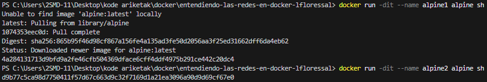

2. Entrad en `alpine1`: `docker attach alpine1`.


3. Intentad hacer `ping alpine2`. **Debe fallar**.


4. Salid sin apagar el contenedor (Ctrl+P, Ctrl+Q).
5. Usad `docker inspect alpine2` para averiguar su `IPAddress`.
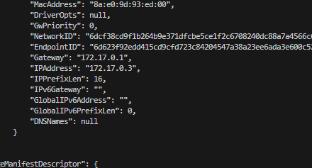

6. Volved a entrar en `alpine1` y haced ping a esa IP. **Debe funcionar**.
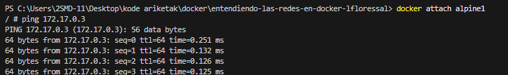

### Ejercicio B: La comodidad de las redes Custom

1. Cread una red nueva: `docker network create red-clase`.
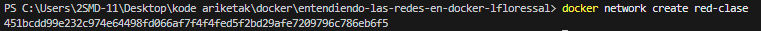

2. Lanzad dos contenedores nuevos conectados a esa red:
* `docker run -dit --name alpine3 --network red-clase alpine sh`
* `docker run -dit --name alpine4 --network red-clase alpine sh`
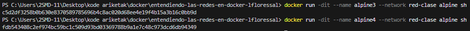

3. Entrad en `alpine3`.
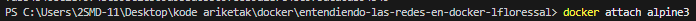

4. Haced `ping alpine4`. **¡Debe funcionar directamente usando el nombre!**

> **Captura de pantalla:** Haced una captura donde se vea el ping exitoso por nombre en el Ejercicio B y guardadla en una carpeta `/evidencias`. Haced commit.

---

## 🏗️ Parte 4: Arquitectura Segura con Docker Compose (40-50 min)

Ahora vamos a aplicar esto a un entorno real. Tenéis que crear un archivo `docker-compose.yml` desde cero.

### El Escenario

Queremos montar una aplicación con 3 capas, pero queremos seguridad máxima mediante **segmentación de redes**.

1. **Servicio `tienda-web**`: El frontend público.
* Imagen: `nginx:alpine`.
* Puerto: Mapead el 8080 de vuestra máquina al 80 del contenedor.


2. **Servicio `logica-negocio**`: El backend que procesa datos.
* Imagen: `curlimages/curl` (Usamos esta para tener el comando curl y ping disponibles).
* Comando: `tail -f /dev/null` (Para que no se apague).


3. **Servicio `base-datos**`: Donde se guardan los datos.
* Imagen: `postgres:alpine`.
* Environment: `POSTGRES_PASSWORD=secret`.


### Las Reglas de Red (IMPORTANTE)

Debéis definir **dos redes** en el `docker-compose.yml`:

* `red-publica`
* `red-privada`

Configurad los servicios así:

* `tienda-web`: Solo pertenece a `red-publica`.
* `base-datos`: Solo pertenece a `red-privada`.
* `logica-negocio`: Pertenece a **ambas** redes (hace de puente).

### La Prueba de Fuego (Verificación)

Una vez levantado (`docker compose up -d`), debéis demostrar que el aislamiento funciona:
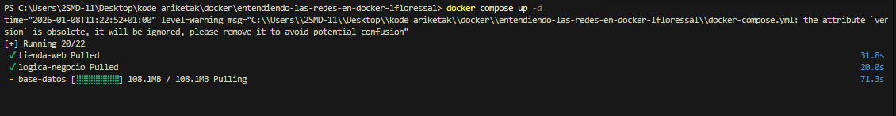

1. Entrad en `tienda-web`: `docker compose exec tienda-web sh`.
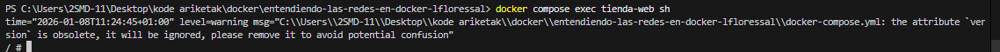

* Intentad `ping logica-negocio` -> **Debe funcionar**.
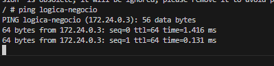

* Intentad `ping base-datos` -> **DEBE FALLAR** (Name or service not known / Host unreachable). *Esto es bueno, significa que el frontend no puede tocar la DB.*
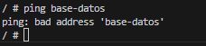

1. Entrad en `logica-negocio`: `docker compose exec logica-negocio sh`.
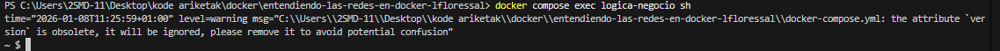

* Intentad `ping base-datos` -> **Debe funcionar**.
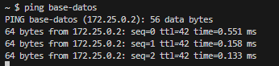

* Intentad `ping tienda-web` -> **Debe funcionar**.
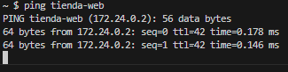


> **Entrega:** Subid el `docker-compose.yml` final. Si no conseguís que falle el ping entre la web y la base de datos, la tarea no está superada.

---

## 🧹 Limpieza

Al terminar, recordad ser limpios:

```bash
docker compose down
docker rm -f alpine1 alpine2 alpine3 alpine4
docker network rm red-clase

```